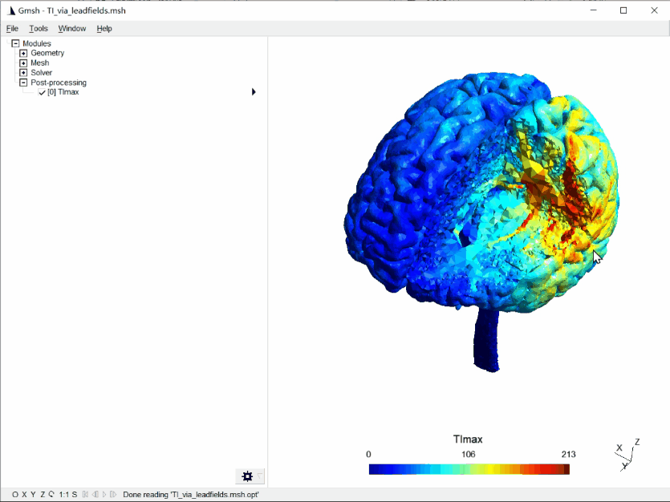
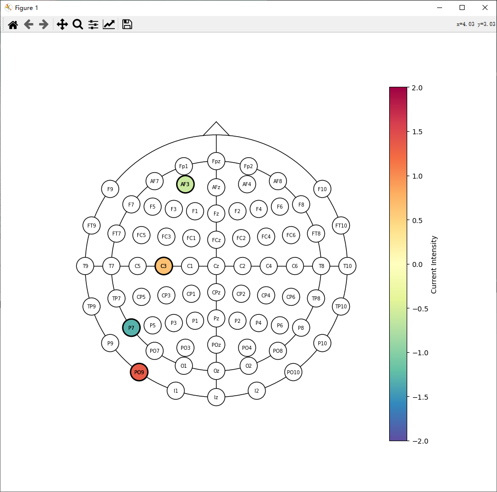

# An optimization and simulation system for temporal interference stimulation based on personalized modeling

## 🎬 Overview

Since the introduction of transcranial temporal interference stimulation(tTIS), there has been an ever-growing interest in this novel method, as it theoretically allows non-invasive stimulation of deep brain target regions.

However, there has been a pressing challenge for finding optimal electrode combinations for stimulating region of interest(ROI). Most of prebvious methods use exhaustive search to find the best match, but faster and, at the same time, reliable solutions are required.

In this study, the electrode combinations as well as the injected current for a two-electrode pair stimulation were optimized using a genetic algorithm(GA), considering the right hippocampus as the region of interest (ROI).



## 🔧 Dependencies and Installation

1. **Clone repo**

```
git clone https://github.com/ch3nboyu/tTIS_Optimizer.git
cd tTIS_Optimizer
```

2. **Install dependent packages**

```
conda env create -f simNIBS_environment_win.yml
conda activate simnibs_env
pip install -f https://github.com/simnibs/simnibs/releases/latest simnibs
pip install --upgrade pip
(maybe u need pip install func_timeout==4.3.5)
pip install -r requirements.txt
```

3. **Install [cupy](https://docs.cupy.dev/en/stable/install.html#installing-cupy-from-pypi)**
   the installation of CuPy can be complex, and u need to install it according to your CUDA version.

```
conda install -c conda-forge cupy
```

4. **Prepare** [example dataset](https://github.com/simnibs/example-dataset/releases/download/v4.1/simnibs4_examples.zip) from simNIBS

**Unzip it and you can get the ***"org/"*** filefolder, which contains the MRI T1 and T2 we need**

## 👉 Proj Structure

```
.
├── README.md
├── config_tTIS.json
├── prepare_headandLF.py
├── optimization_tTIS.py
├── performones_tTIS.py
├── ...
├── gui_v2.py
├── utils
│   ├── GA.py
│   ├── TI_utils.py
│   ├── modulation_envelope.py
│   ├── solveTIME.py
│   └── utils.py
└── examples
    ├── leadfield  
    ├── leadfield_tet
    ├── m2m_ernie    # Mesh
    └── org          # Example Dataset
```

## ⚡ Pipeline

1. **Edit config\_tTIS.json**

```
{
    "data_path": ".\\examples\\org", # Path to your MRI
    "output_path": ".\\output",      # Output path
    "subMark": "ernie",              # Subject mark
    "simMark": "Insula_L",           # Simulation mark
    "exampleIdx": 1,
    "eeg-posi": "EEG_10_10",
    "initialElecNum": 4,
    "cur_max": 1.5,
    "cur_min": 0.5,
    "cur_sum": 2.0,
    "precision": 0.01,
    "type": "tet",
    "thres": 0.2,
    "nt": 0,
    ...
    "case1": {
        "num": 1,
        "name": ["Insula_L"],
        "coordMNI": [[-34.24929, 2.41357, -9.37102]],
        "shape": ["sphere"],
        "radius": [4],
        "intensity": -1.0,
        "otheralpha": -1.0
    },
    ...
    "avoid":{
        "num": 2,
        "name": ["l.dlPFC", "r.dlPFC"],
        "coordMNI": [[-44, 6, 33], [43, 9, 30]],
        "shape": ["sphere", "sphere"],
        "radius": [10, 10],
        "coef": 1.0
    }
}
```

2. **Modeling and computing leadfield**

```
python prepare_headandLF.py
```

3. **Optimize electrode combination**

```
python optimization_tTIS.py
```

and you can see the result:


4. **Visualization**

```
python performones_tTIS.py
```


## 👀 Only simulation

1. **Edit result.json**

```
{
    "electrodes": [
        "AF3",
        "C3",
        "P7",
        "PO9"
    ],
    "currents": [
        0.6,
        -0.6,
        1.34,
        -1.34
    ]
}
```

2. **Visualization**

```
python performones_tTIS.py
```

## 📺More for visualization

You can use "Tools -> Clipping" in Gmsh to observe your results in detail.

